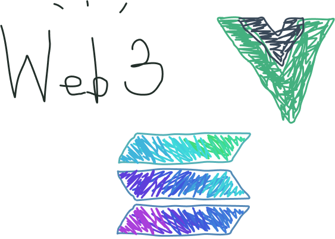

# Escrow program for Solana blockchain

## Tech stack
- Program (Smart Contract)
	- Rust crates: solana-program, spl-token 
	- Solana CLI for test validator
- UI
	- Typescript libs: @solana/web3.js
	- Frontend Framework: Vue.js

# Reference
This is a follow-along learning material from @paul-schaaf 's blog.
- Check out his Solana tutorial: https://paulx.dev/blog/2021/01/14/programming-on-solana-an-introduction/
- Check out his Github Profile: https://github.com/paul-schaaf 